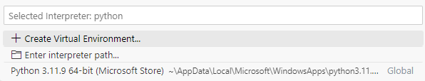

# How to use VS Code for Python and Github?
## Step 1: Download + Set up VS Code

## Step 2: Install Extensions
### Choose this icon

### In the search bar, find the following extensions + Select "Install"
- Python (recent version: v2024.4.1)
- GitHub Pull Requests (recent version: v0.82.1)
  
For example:

## Step 3: Install Python Software in Microsoft store

When using python files on VS Code, please choose the interpreter the downloaded Python software.  

